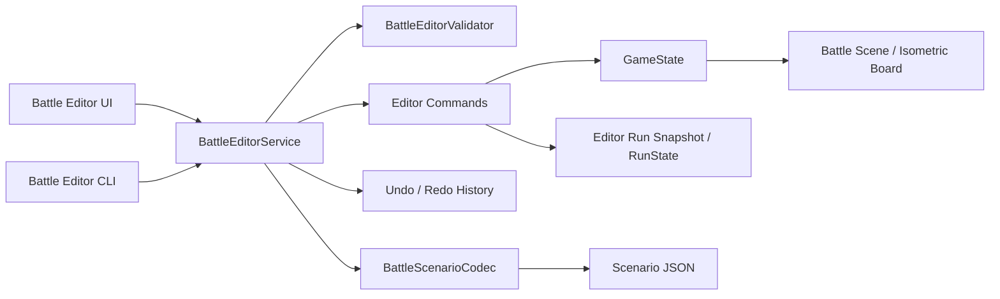

# 战斗可视化编辑器技术方案

## 文档目标

本文档用于设计一套运行在战斗场景内的可视化测试编辑器，方便快速搭建局面、获取测试资源，并验证宝石、遗物、怪物、地形、overlay 与实体之间的交互、效果和数值。

编辑器的首要目标不是替代 Godot 编辑器制作正式关卡，而是把当前需要通过改 JSON、重启战斗或输入 Editor CLI 命令才能完成的操作，收敛成可视化、可撤销、可复现的测试工作流。

重点解决：

- 自定义地块、overlay、实体和怪物。
- 自由增加 / 移除遗物。
- 随意获取并放置宝石。
- 放置不会主动行动的训练稻草人，并观察伤害结果。
- 从资源面板拖拽 item 到棋盘，hover 时显示合法性高亮，松手立即执行。
- 将当前测试局面导出为 JSON，并可重新加载。

## 当前基础

项目已经具备一套可复用的战斗内 Editor CLI：

- `scripts/debug/battle_editor_cli.gd`
  - 放置、批量放置、移动、删除单位。
  - 修改单位数值。
  - 放置地块和宝石。
  - 导出部分 encounter 数据。
- `scripts/ui/editor_console.gd`
  - F9 打开的命令行面板。
- `scripts/ui/board_input_adapter.gd`
  - 已能把鼠标位置解析为棋盘格。
- `scripts/ui/isometric_board.gd`
  - 已支持 hover 与多种棋盘高亮。
- `GameState`
  - 已统一持有单位、宝石、地块、实体等战斗状态。

因此，可视化编辑器不应直接复制一套修改 `GameState` 的逻辑。建议先把 Editor CLI 中真正的状态修改能力抽成共享服务，再由 CLI 和可视化 UI 共同调用。

当前 Editor CLI 仍有以下缺口：

- 不支持实体和 overlay 的增删。
- 不支持遗物增删。
- 不支持 JSON 导入。
- encounter 导出不包含实体、overlay、单位数值覆盖等完整数据。
- 当前格式化输出使用 `Vector2i(...)`，适合粘贴到代码，不是严格 JSON。
- 不支持撤销 / 重做。
- UI 无资源预览、拖拽、合法落点反馈和属性检查器。

## 术语与数据边界

为避免 UI overlay 与战斗规则中的 overlay 混淆，本文统一使用以下术语：

| 术语 | 当前实现 | 示例 |
| --- | --- | --- |
| 地块 Ground Tile | `TileState.tile_id` | 地板、水、冰、草地、机关柱 |
| 地表效果 Overlay | `TileState.modifiers` | 火焰、毒雾、毒烟、毒水洼 |
| 实体 Entity | `EntityState` | 石块、地刺、油桶、装饰物 |
| 单位 Unit | `UnitState` | 玩家、怪物、训练稻草人 |
| 宝石 Gem | `GemState` + `SlotState` | 爆炸、剧毒、引力宝石 |
| 遗物 Relic | `RunState.owned_relics` | 棱镜、呼吸面罩等 |

编辑器修改的是当前测试会话中的真实运行时状态，使测试行为尽量与正式战斗一致；但编辑器会话必须与正式 run 存档隔离。

## 核心原则

### 1. UI 与状态修改解耦

UI 只产生结构化编辑命令，不直接写 `GameState`、`RunState` 或节点属性。

```gdscript
{
	"type": "place_unit",
	"payload": {
		"unit_def_id": "unit_bomb_rat",
		"team": "enemy",
		"pos": Vector2i(4, 2),
	}
}
```

统一由 `BattleEditorService.execute(command)` 完成校验、修改、刷新与结果返回。

### 2. 编辑结果立即可测试

放置完成后不进入额外确认流程。服务需要统一完成：

- 重建单位占格索引。
- 重新计算地块边缘与表现。
- 同步地形 / overlay 对站立单位的效果。
- 刷新敌人意图。
- 刷新棋盘和 HUD。
- 必要时重新打开已结束战斗。

### 3. 编辑操作可撤销、可复现

所有改变局面的操作都进入命令历史。JSON 导出结果应可重新导入并得到等价局面。

### 4. 测试状态不污染正式存档

编辑器开启时创建 `BattleEditorSession`，保存进入编辑器前的 run 级快照，尤其包括：

- `owned_relics`
- `relic_runtime`
- 玩家槽位与携带宝石
- 玩家生命值和最大生命值

编辑器关闭或离开战斗时默认恢复快照。只有显式选择“应用到当前 run”时才允许保留 run 级修改。

### 5. Debug Only

编辑器入口、快捷键和服务只在 `OS.is_debug_build()` 或显式 debug feature flag 下启用，正式构建不实例化编辑器 UI，也不接受编辑命令。

## 总体架构



### 建议新增模块

| 文件 | 职责 |
| --- | --- |
| `scripts/debug/battle_editor_service.gd` | 编辑器统一入口、命令执行、刷新、会话生命周期 |
| `scripts/debug/battle_editor_validator.gd` | 放置合法性与命令参数校验 |
| `scripts/debug/battle_editor_history.gd` | 撤销 / 重做历史 |
| `scripts/debug/battle_scenario_codec.gd` | 严格 JSON 导入、导出、版本迁移 |
| `scripts/debug/battle_damage_recorder.gd` | 训练稻草人伤害统计 |
| `scripts/ui/battle_editor_panel.gd` | 左右编辑面板与资源目录 |
| `scripts/ui/battle_editor_drag_controller.gd` | 拖拽状态、hover 校验与落点执行 |
| `scenes/ui/battle_editor_panel.tscn` | 编辑器 UI 场景 |
| `scripts/rules/behaviors/behavior_training_dummy.gd` | 稻草人空行动行为 |

### 建议改造现有模块

- `battle_editor_cli.gd`
  - 保留命令解析和文本输出。
  - 状态修改改为调用 `BattleEditorService`，不再自己维护修改逻辑。
- `battle_controller.gd`
  - 持有并初始化 `BattleEditorService`。
  - 对 UI 暴露结构化编辑 API。
- `board_input_adapter.gd`
  - 增加鼠标按下、拖拽移动、松手和取消信号。
- `isometric_board.gd`
  - 增加编辑器合法 / 非法落点高亮和多格 footprint 预览。
- `battle_scene.gd`
  - 管理编辑器模式切换、左右面板显隐和普通战斗输入屏蔽。

## 编辑器模式

建议提供两个互斥模式，降低“编辑局面时误触发战斗操作”的概率。

### 编辑模式

- 普通点击和拖拽用于选择、放置、移动和删除对象。
- 暂停敌方行动、战斗结算和输入驱动的技能操作。
- 可自由修改资源与属性。
- 默认不触发“进入地块”“受到伤害”等规则效果，避免搭建过程中局面自行变化。
- 用户可通过“应用并同步”显式执行站立地形同步和意图刷新。

### 测试模式

- 恢复正常战斗操作和规则结算。
- 编辑面板仍可保持可见，允许随时添加测试对象。
- 放置 overlay 等操作按真实规则立即触发。
- 提供“一键重置到测试起点”。

模式切换时，编辑器保存一份测试起点快照。这样可以反复执行同一个攻击或宝石组合，而不必重新搭建局面。

## UI 布局

编辑器沿用当前棋盘居中的布局，合理使用棋盘左右两侧，不在棋盘上覆盖大面积浮层。

```text
┌──────────────┬──────────────────────────────────┬──────────────┐
│ 左侧资源面板 │              棋盘                │ 右侧检查器   │
│              │                                  │              │
│ 搜索         │         hover / 拖拽预览          │ 当前选择     │
│ 分类 Tabs    │                                  │ 属性编辑     │
│ 资源列表     │                                  │ 槽位 / 宝石  │
│              │                                  │ 伤害统计     │
├──────────────┴──────────────────────────────────┴──────────────┤
│ 撤销  重做  编辑/测试  重置  导入  导出  清空  F9 CLI         │
└────────────────────────────────────────────────────────────────┘
```

### 左侧：资源目录

固定宽度建议为 `260-300px`，包含：

- 搜索框：按显示名、资源 id、tag 搜索。
- 分类 Tabs：
  - 地块
  - Overlay
  - 实体
  - 怪物
  - 宝石
  - 遗物
  - 测试工具
- 资源条目显示图标、名称和关键标签。
- 资源条目支持拖拽；单击后进入连续画笔模式。
- 地块与 overlay 支持画笔大小、矩形填充和擦除工具。

资源目录数据必须来自 `DataRegistry` 或专门的 editor catalog，不能在 UI 中维护硬编码资源列表。

### 右侧：选择与检查器

固定宽度建议为 `300-340px`，显示当前格和当前选择对象：

- 格坐标、地块、overlay 列表、实体、单位。
- 单位属性：HP、最大 HP、攻击、移动、速度、队伍、存活状态。
- 单位 / 地块槽位与已插入宝石。
- Overlay 持续回合与 payload。
- 实体 HP、sprite variant。
- 训练稻草人的伤害统计。
- 删除、复制、移动到、恢复满血等明确操作。

属性编辑提交后也必须通过编辑命令执行，以便撤销和校验。

### 底部工具栏

使用图标按钮和 tooltip，包含：

- 撤销 / 重做。
- 编辑模式 / 测试模式切换。
- 保存测试起点 / 重置到测试起点。
- 导入 / 导出 JSON。
- 清空战场。
- 打开现有 F9 CLI。

### 响应式策略

- 宽屏：左右面板同时展示。
- 中等宽度：右侧检查器改为可折叠抽屉。
- 窄屏：只展示当前激活面板，棋盘保持最大可用面积。
- 面板显隐不应改变棋盘逻辑坐标，只调整棋盘视觉偏移或可用视口。

## 拖拽与棋盘交互

### 拖拽状态

`BattleEditorDragController` 维护：

```gdscript
{
	"kind": "unit",
	"resource_id": "unit_fission_slime",
	"options": {"team": "enemy"},
	"hover_cell": Vector2i(-1, -1),
	"validation": {},
}
```

### 交互流程

1. 从左侧资源目录按下并开始拖拽。
2. 鼠标进入棋盘时，通过 `pick_cell()` 获取目标格。
3. `BattleEditorValidator.preview_drop()` 返回合法性和受影响格。
4. 棋盘绘制预览：
   - 绿色：允许放置。
   - 红色：禁止放置。
   - 黄色：允许放置但会覆盖 / 触发反应。
5. 松手时调用 `BattleEditorService.execute()`。
6. 成功后立即刷新；失败时保持局面并显示简短原因。
7. `Esc` 或右键取消拖拽。

### 不同资源的落点规则

| 资源 | 默认松手行为 |
| --- | --- |
| 地块 | 替换目标格 `tile_id` |
| Overlay | 添加或更新目标格 modifier |
| 实体 | 在目标格创建实体 |
| 怪物 | 在目标格创建敌方单位 |
| 宝石 | 优先插入目标单位可接受槽位，其次插入地块槽位；无合法槽位时拒绝 |
| 遗物 | 不需要棋盘落点，拖入玩家信息区或单击 `+` 获取 |
| 训练稻草人 | 放置 `unit_training_dummy` |
| 擦除工具 | 按当前擦除层级删除对象 |

### 放置合法性

校验必须考虑：

- 是否越界。
- 单位 footprint 是否全部在棋盘内。
- footprint 是否与其他单位重叠。
- 实体是否阻挡单位放置。
- 单格是否已有同类实体。
- 宝石颜色是否被槽位接受、槽位是否锁定。
- overlay 是否允许存在于当前地块，以及是否会发生反应。
- 删除地块或替换机关柱时，已有宝石如何处理。

覆盖性操作必须在预览结果中明确说明，例如“替换机关柱会删除其蓝槽宝石”。默认策略为允许覆盖，但使用黄色高亮并记录为一个可撤销命令。

## 编辑命令模型

建议支持以下命令：

### 棋盘对象

- `set_tile`
- `paint_tiles`
- `add_overlay`
- `remove_overlay`
- `place_entity`
- `remove_entity`
- `place_unit`
- `move_unit`
- `remove_unit`
- `duplicate_unit`
- `set_player_spawn`

### 宝石与槽位

- `insert_gem`
- `remove_gem`
- `replace_gem`
- `set_held_gem`
- `clear_held_gem`
- `add_slot`
- `remove_slot`
- `set_slot_lock`

### 属性与资源

- `set_unit_stat`
- `set_entity_stat`
- `set_overlay_payload`
- `add_relic`
- `remove_relic`
- `clear_relics`

### 会话与场景

- `clear_board_layer`
- `capture_test_checkpoint`
- `restore_test_checkpoint`
- `import_scenario`
- `export_scenario`

每个执行结果建议统一返回：

```gdscript
{
	"ok": true,
	"message": "placed unit_training_dummy at 4,3",
	"changed_cells": [Vector2i(4, 3)],
	"selection": {"kind": "unit", "uid": "runtime_unit_12"},
	"warnings": [],
}
```

## 撤销与重做

首版建议使用命令前后局部快照，而不是手写每条命令的逆操作：

- 命令执行前收集其可能影响的单位、宝石、地块、实体和 run 级遗物状态。
- 命令执行后保存对应结果。
- 撤销时恢复 before snapshot，重做时恢复 after snapshot。
- 批量绘制在鼠标按下到松手之间合并成一条历史记录。

对于“清空战场”“导入场景”等大范围操作，可以保存完整 `GameState.clone()` 和 editor run snapshot。

历史默认保留最近 50 条，避免调试会话无限占用内存。

## 地块、Overlay 与实体

### 地块

当前 `DataRegistry.get_tile_ids()` 只暴露地板、水和机关柱，编辑器落地前应补齐可用地块目录，包括冰、草地和草丛等已有常量。

替换地块后必须：

- 重新初始化 `ground_tags`。
- 处理特殊地块默认槽位。
- 清理已不存在槽位中的宝石。
- 重新计算 edge mask 与 floor variation。
- 在测试模式下同步站立单位的地形状态。

### Overlay

Overlay 不能直接由 UI 调用 `tile.add_modifier()`。应通过规则层入口创建，确保火焰、水、毒雾等反应与正式战斗一致。

建议在 `TileRules` 增加统一入口：

```gdscript
static func create_overlay(
	state: GameState,
	overlay_id: String,
	pos: Vector2i,
	duration: int,
	payload: Dictionary = {}
) -> Dictionary
```

该入口内部再分发到 `create_fire()`、`create_poison_fog()` 等现有函数。编辑器目录通过 `get_overlay_catalog()` 获取默认持续回合、显示名、颜色和允许编辑的 payload 字段。

### 实体

当前实体定义主要硬编码在 `EntityState._init_from_def()`。为支持编辑器资源目录和后续扩展，建议逐步迁移为 `resources/entities/entity_defs.json`，至少包含：

- `entity_id`
- 显示名与图标
- 默认 HP
- tags
- 可选 sprite variants
- 编辑器分类与排序

首版也可先由 `DataRegistry.get_entity_catalog()` 包装现有常量，避免迁移阻塞编辑器实现。

## 怪物与训练稻草人

### 怪物放置

拖拽怪物时默认创建敌方单位，并使用 `unit_defs.json` 中的完整定义。高级选项可设置：

- 队伍：敌方 / 友方。
- 是否按正式生成规则随机装配宝石。
- 是否使用模板内固定宝石。
- 初始 HP 和属性覆盖。
- 是否立即刷新意图。

默认使用固定模板，避免测试结果受随机生成影响；需要测试随机生成池时再显式开启“按正式生成规则生成”。

### 训练稻草人

新增 `unit_training_dummy`，建议配置：

- `behavior_id: "training_dummy"`
- 不移动、不攻击、不生成行动意图。
- 默认高生命值，可在检查器调整。
- 默认作为敌方目标，能够进入正常攻击与宝石效果链路。
- tag：`unit:training_dummy`。
- 可选开关：
  - 受到致死伤害后自动恢复满血。
  - 不触发击杀效果。
  - 允许触发击杀效果后复活。
  - 免疫位移 / 状态 / overlay。
  - 清空伤害统计。

为了避免训练稻草人导致测试中断，编辑器测试模式下建议支持 `suppress_battle_end`。开启后，即使所有普通敌人死亡，战斗也不会自动进入结算；关闭编辑器后恢复正式结算规则。

### 伤害统计

`BattleDamageRecorder` 监听 `GameState.on_damage_taken`、`on_attack_hit` 和 `on_unit_die`，只记录被标记为训练目标的单位。

右侧检查器展示：

- 最近一次伤害。
- 本次攻击总伤害。
- 累计伤害。
- 命中次数。
- 最大单次伤害。
- 按 `reason` 分类的伤害明细。
- 状态、overlay、碰撞等间接伤害。
- 从上次重置开始经过的回合数。

伤害记录属于 editor session，不写入 encounter JSON，也不影响战斗规则。

## 遗物测试

遗物目录来自 `DataRegistry.get_relic_defs()`，支持搜索、单击 `+` 获取和单击 `-` 移除。

遗物修改通过 `RunService.acquire_relic()` / `remove_relic()` 或 editor run adapter 执行，使 `RelicEffectRegistry` 读取到真实状态。

需要明确区分遗物效果触发时机：

- 持续 modifier：增加后应立即生效。
- `battle_start` 效果：增加遗物后默认不补触发，UI 标记“重启测试后生效”。
- 一次性 run 效果：测试会话应允许重置对应 `relic_runtime`。
- 移除遗物：不会自动回滚已经发生的永久属性变化，推荐通过“重置到测试起点”验证。

编辑器关闭时恢复进入前的遗物快照，避免污染正式 run。

## 宝石获取与放置

宝石应支持三种快速使用方式：

1. 拖到单位或机关地块槽位，直接插入。
2. 在右侧选中单位后，点击目标槽位旁的 `+` 并选择宝石。
3. 拖到“手持宝石”区域，设置为 `held_gem_uid`，用于测试嵌入行为。

默认替换策略：

- 空槽：直接插入。
- 已有宝石：黄色预览，松手后替换；原宝石从 `GameState.gems` 删除。
- 锁定槽：红色预览并拒绝，除非开启“忽略槽位锁”测试选项。
- 颜色不兼容：红色预览并拒绝，除非开启“忽略颜色限制”。

编辑器还应允许修改 `gem.def_overrides`，用于快速测试数值覆盖，但导出时必须明确写入 JSON。

## JSON 导入与导出

### 两种导出目标

建议明确区分：

- Encounter JSON：用于正式遭遇战资源，尽量只包含初始局面。
- Test Scenario JSON：用于完整复现调试现场，可包含运行时属性覆盖、overlay、遗物和编辑器设置。

### Encounter JSON

建议补全现有格式：

```json
{
  "schema_version": 2,
  "player_spawn": [1, 6],
  "floor_seed": 12345,
  "enemies": [
    {
      "def_id": "unit_bomb_rat",
      "pos": [4, 2],
      "slots": [
        {"slot_type": "red", "gem_id": "gem_explosion"}
      ]
    }
  ],
  "entities": [
    {"entity_id": "entity_barrel", "pos": [4, 4]}
  ],
  "tiles": [
    {
      "pos": [3, 3],
      "tile_id": "tile_water",
      "overlays": [
        {"type": "poison_puddle", "duration": 2, "payload": {}}
      ]
    }
  ]
}
```

`BoardMapGenerator.build()` 需要支持从 `tiles[].overlays` 恢复 modifier。

### Test Scenario JSON

在 Encounter JSON 基础上增加：

```json
{
  "scenario_version": 1,
  "encounter": {},
  "runtime": {
    "turn_index": 1,
    "phase": "player",
    "unit_overrides": {},
    "held_gem": null,
    "owned_relics": [],
    "relic_runtime": {}
  },
  "editor": {
    "suppress_battle_end": true,
    "mode": "test"
  }
}
```

### 导入校验

导入必须先解析和校验，全部通过后再一次性替换当前状态：

- schema version 是否支持。
- 资源 id 是否存在。
- 坐标是否越界。
- 单位 footprint 是否冲突。
- 宝石与槽位是否合法。
- overlay 类型是否支持。
- 未知字段给出 warning，不直接崩溃。

导入失败时保持当前场景不变。导入成功应记录为一条可撤销操作。

## 状态刷新与规则一致性

所有编辑命令最终统一执行刷新阶段，避免每个 UI 操作各自遗漏：

```gdscript
func _finalize_edit(result: Dictionary, policy: Dictionary) -> Dictionary:
	if policy.get("rebuild_occupancy", false):
		state.rebuild_occupancy()
	if policy.get("rebuild_tiles", false):
		BoardMapGenerator.refresh_runtime_visual_data(state)
	if policy.get("sync_ground", false):
		TileRules.sync_all_units_standing_ground(state)
	if policy.get("refresh_intents", false):
		IntentSystem.refresh_all_intents(state)
	controller._emit_changed()
	return result
```

需要把当前 CLI 内部的 `_refresh_runtime_tile_visuals()` 下沉到 `BoardMapGenerator` 公共方法，避免 CLI 与可视化编辑器维护两份刷新逻辑。

## 防误操作与边界行为

- 编辑器模式暂停普通棋盘点击，防止放置时同时触发移动或攻击。
- 拖拽过程中隐藏普通战斗 hover preview，改为显示放置预览。
- 删除当前玩家单位必须禁止；可以移动玩家出生点或修改玩家属性。
- 删除单位时同步清理其宝石、选择状态和占格索引。
- 删除机关地块时同步清理槽位宝石。
- 删除 held gem 时同步清空 `held_gem_uid`。
- 放置多格单位时高亮全部 footprint。
- 清空战场默认保留玩家和基础地板。
- 编辑器修改不应写入战绩、成就、图鉴或正式 run 历史。
- 导出的 JSON 应稳定排序，减少版本控制 diff。

## 测试方案

### 服务层单元测试

新增 `scripts/tests/battle_editor_service_test.gd`，覆盖：

- 放置 / 移动 / 删除单格和多格单位。
- 放置怪物后占格索引正确。
- 地块替换后 edge mask、ground tags 和槽位清理正确。
- overlay 添加、叠加、移除与地块反应正确。
- 实体放置、删除和冲突校验正确。
- 宝石插入、替换、删除与 held gem 正确。
- 遗物增删与 session 恢复正确。
- 撤销 / 重做可恢复等价状态。
- 导出后重新导入得到等价局面。

### 稻草人测试

新增 `scripts/tests/training_dummy_test.gd`，覆盖：

- 稻草人不会行动。
- 正常攻击、宝石、状态、overlay 和碰撞伤害能够被记录。
- 自动恢复和击杀触发策略符合配置。
- `suppress_battle_end` 开启时不会结束战斗。

### UI 测试

- 资源目录能从 registry 构建。
- 拖拽到合法格执行一次放置。
- 拖拽到非法格不修改状态。
- hover 高亮覆盖多格单位 footprint。
- 左右面板开启后不遮挡核心棋盘操作区。
- 编辑 / 测试模式切换后输入路由正确。

### 回归测试

保留现有 `hook_test.gd` 中 Editor CLI 测试，并改为验证 CLI 与可视化 UI 共用服务。现有正式战斗流程在编辑器关闭时行为不得变化。

## 分阶段实施

### P0：共享编辑服务

- 从 `battle_editor_cli.gd` 抽出 `BattleEditorService`。
- 保持现有 CLI 命令行为不变。
- 增加实体、overlay、遗物命令。
- 增加严格 JSON codec 和完整导出。
- 补服务层测试。

完成标准：不做可视化 UI，也能通过 CLI 完整搭建并导入 / 导出测试局面。

### P1：可视化基础编辑器

- 增加左右面板和底部工具栏。
- 实现资源目录、搜索和当前格检查器。
- 实现地块、overlay、实体、怪物拖拽放置。
- 实现合法 / 非法 hover 高亮。
- 实现删除、移动、撤销 / 重做。

完成标准：无需输入命令即可搭建一个完整 encounter。

### P2：宝石、遗物与测试会话

- 宝石拖入槽位、手持宝石区域和快速替换。
- 遗物自由增删。
- editor run snapshot 与退出恢复。
- 编辑 / 测试模式、测试起点和一键重置。

完成标准：可稳定反复测试宝石与遗物组合，且不会污染正式 run。

### P3：训练稻草人与数值面板

- 新增训练稻草人及行为。
- 增加伤害 recorder 和统计检查器。
- 增加自动恢复、击杀触发与战斗结束抑制选项。

完成标准：可以清晰验证一次攻击的总伤害与各来源明细。

### P4：效率增强

- 矩形填充、多格画笔、框选、复制粘贴。
- 收藏 / 最近使用资源。
- 场景模板与测试用例命名保存。
- 从失败测试或 bug 报告直接加载 scenario。
- 将 scenario 作为自动化回归测试 fixture。

## 验收清单

- [x] 编辑器只在 debug 环境可用。
- [x] 左右面板合理利用棋盘两侧空间，棋盘核心区域不被大面积遮挡。
- [x] 可拖拽地块、overlay、实体、怪物和训练稻草人到棋盘。
- [x] hover 时明确显示合法、非法和覆盖性落点。
- [x] 松手立即执行放置，失败时不改变局面。
- [x] 可自由增加、移除遗物，并在退出编辑器后恢复正式 run 状态。
- [x] 可随意创建宝石，明确选择单位 / 地块槽位，并按颜色新增任意数量槽位。
- [x] 可使用训练稻草人测试并查看伤害来源明细。
- [ ] 可设置为手持宝石。
- [ ] 可撤销、重做和一键重置到测试起点。
- [x] 可导出严格 JSON，并可重新加载得到等价局面。
- [x] CLI 与可视化 UI 共用同一状态修改服务。
- [x] 编辑器关闭时现有战斗流程和输入行为不受影响。

## 当前 TODO

### 已完成

- 主菜单单独入口进入测试编辑场景，不再混入正常冒险 / 战斗流程。
- 共享 `BattleEditorService`，CLI 与可视化编辑共用。
- 地块 / overlay / 实体 / 怪物 / 宝石 / 遗物的基础可视化编辑。
- 宝石槽位选择弹窗，可替换指定槽位，或连续新增红 / 蓝 / 黑槽并嵌入同类宝石。
- 拖拽放置、hover 合法性预览、落点立即执行。
- 面板拖拽、折叠、关闭与重新展开。
- 战斗操作与放置工具解耦：战斗点击始终有效，仅原生拖拽松手执行放置，关闭放置工具不会回滚当前局面。
- 遗物条独立显示在左侧血条下方，编辑器自动排在其下，不再嵌入血条信息区域。
- 编辑器创建的石块 / 静物自动分配正确贴图，油桶、地刺与全部 overlay 均有明确棋盘视觉。
- 训练稻草人、受击统计、右侧检查器删除操作。
- Encounter 严格 JSON 导出与重新加载。
- debug-only 闸门，以及退出编辑模式后的 run / 战斗状态恢复。

### 剩余

- 撤销 / 重做与“重置到测试起点”。
- 手持宝石直接设置与清空。
- 矩形填充、多格画笔、复制粘贴等效率工具。
- 更细的伤害来源分段统计和历史记录。
- 可视化导入 / 导出按钮与命名场景模板。

## 推荐优先级结论

最优先的工程工作不是直接搭 UI，而是先把现有 Editor CLI 的修改逻辑抽成 `BattleEditorService`，并补齐实体、overlay、遗物和完整 JSON codec。这样可视化编辑器只负责表达用户意图，CLI、自动化测试和未来的 bug scenario 加载都能共享同一套可靠能力。

当前版本已经覆盖 P0、P1，以及 P2 / P3 的关键能力。剩余工作主要集中在效率工具和编辑历史，而不是基础测试闭环。
